---
header-includes: |
  \usepackage{float}
  \let\origfigure\figure
  \let\endorigfigure\endfigure
  \renewenvironment{figure}[1][]{
    \origfigure[H]
  }{
    \endorigfigure
  }
---


---
title: "Лабораторная работа № 6"
author: "ЧжуЖуйи"
date: "10 ноября 2025 г."
---


# Цель работы
  Освоение арифметических инструкций языка ассемблера NASM.

# Порядок выполнения лабораторной работы

## Символьные и численные данные в NASM 

1. Создайте каталог для программам лабораторной работы № 6, перейдите в него и создайте файл lab6-1.asm:
```bash
mkdir ~/work/arch-pc/lab06
cd ~/work/arch-pc/lab06
touch lab6-1.asm
```


2. Рассмотрим примеры программ вывода символьных и численных значений. Программы будут выводить значения записанные в регистр eax.

*Листинг 6.1. Программа вывода значения регистра eax*

```bash
%include 'in_out.asm'

SECTION  .bss
buf1:     RESB 80

SECTION .text
GLOBAL _start
 _start:
 
 mov eax,'6'
 mov ebx,'4'
 add eax,ebx
 mov [buf1],eax
 mov eax,buf1
 call sprintLF

 call quit
```


```bash
nasm -f elf lab6-1.asm
ld -m elf_i386 -o lab6-1 lab6-1.o
./lab6-1
```

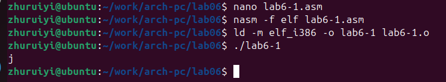


3. Далее изменим текст программы и вместо символов, запишем в регистры числа. Исправьте текст программы (Листинг 6.1) следующим образом: замените строки
```bash
mov eax,'6'
mov ebx,'4'
```
на строки
```bash
mov eax,6
mov ebx,4
```


*Даже если программа выполняет сложение чисел (6 + 4 = 10), она всё равно не выведет число 10. Вместо этого она интерпретирует результат (число 10) как символ ASCII. Код ASCII 10 соответствует символу LF (перевод строки). Перевод строки — это управляющий символ, который не виден на экране, но вызывает перемещение курсора на следующую строку. Поэтому вы можете увидеть только пустую строку в выводе или перемещение курсора на новую строку, не видя при этом числа «10».*


4. Как отмечалось выше, для работы с числами в файле in_out.asm реализованы подпрограммы для преобразования ASCII символов в числа и обратно. Преобразуем текст программы из Листинга 6.1 с использованием этих функций.

  Создайте файл lab6-2.asm в каталоге ~/work/arch-pc/lab06 и введите в него текст программы из листинга 6.2.
```bash
touch ~/work/arch-pc/lab06/lab6-2.asm
```

*Листинг 6.2. Программа вывода значения регистра eax*
```bash
%include 'in_out.asm'

 SECTION .text
 GLOBAL _start
  _start:

  mov eax,'6'
  mov ebx,'4'
  add eax,ebx
  call iprintLF

  call quit
```

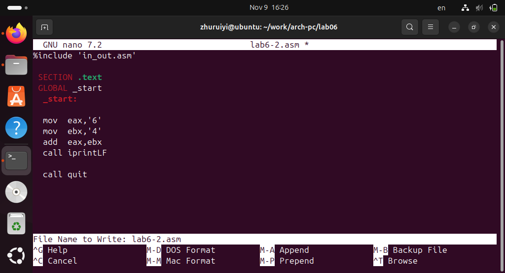

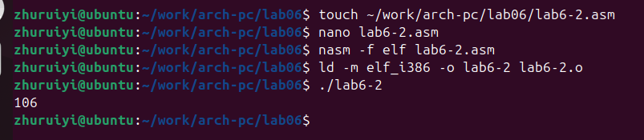


5. Аналогично предыдущему примеру изменим символы на числа. Замените строки
```bash
mov eax,'6'
mov ebx,'4'
```
на строки
```bash
mov eax,6
mov ebx,4
```

*Отображаемый результат изменился со 106 на 10.(программа выполняет операцию 6 + 4, и результат в eax равен 10. Функция iprintLF преобразует число 10 в строку «10» и выведет её, добавив символ новой строки.)*


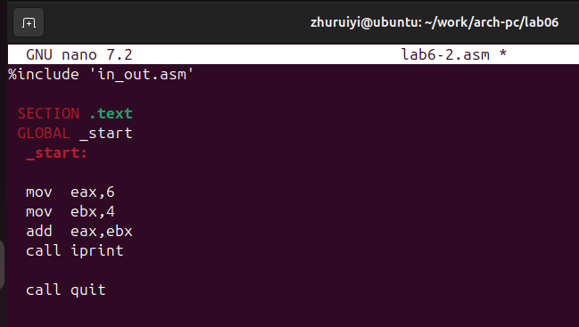


Различия:

* `iprintLF`: Автоматически добавляет символ новой строки после вывода числовой строки. Курсор перемещается в начало следующей строки после вывода. (рис.8)

* `iprint`: Выводит только числовую строку без добавления символа новой строки. Курсор остаётся в конце вывода. (рис.10)

* Например, если есть дальнейший вывод (без символа новой строки), он будет выведен сразу после числа (как показано на рисунке). (рис.11)


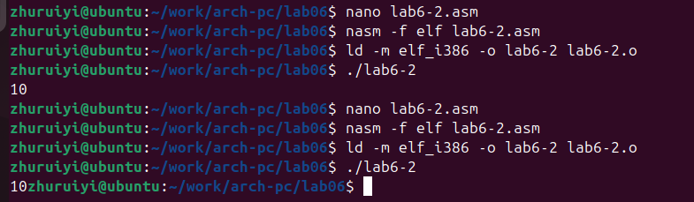


## Выполнение арифметических операций в NASM 

6. В качестве примера выполнения арифметических операций в NASM приведем программу вычисления арифметического выражения 𝑓(𝑥) = (5 ∗ 2 + 3)/3

  Создайте файл lab6-3.asm в каталоге ~/work/arch-pc/lab06:
```bash
touch ~/work/arch-pc/lab06/lab6-3.asm
```

  Внимательно изучим текст программы из листинга 6.3 и введём в lab6-3.asm.

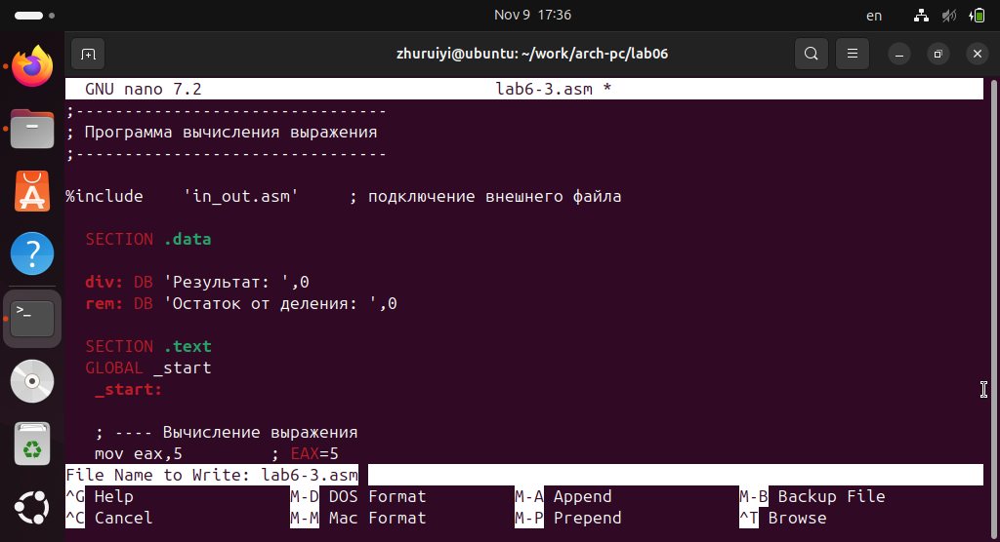

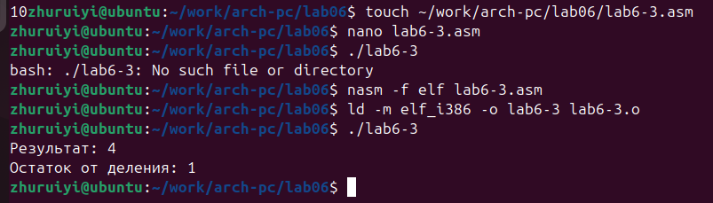


  Измените текст программы для вычисления выражения 𝑓(𝑥) = (4 ∗ 6 + 2)/5. Создайте исполняемый файл и проверьте его работу.

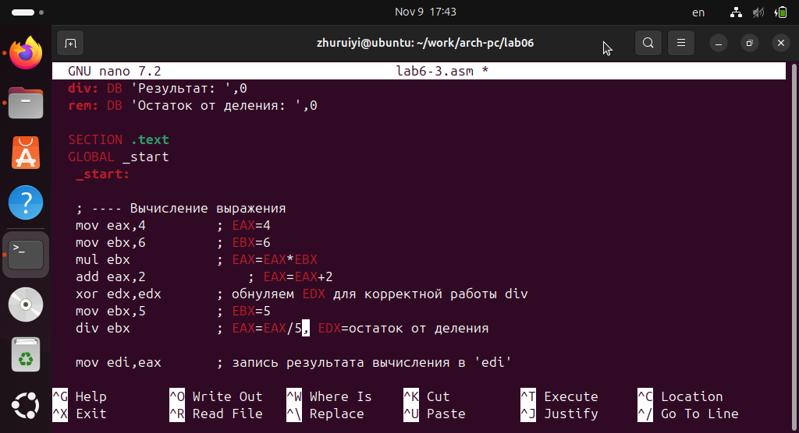

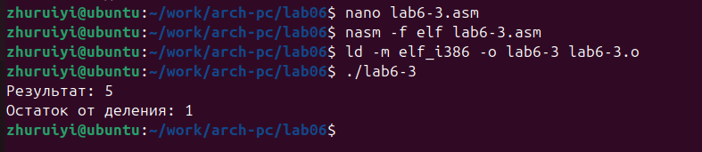


7. В качестве другого примера рассмотрим программу вычисления варианта задания по номеру студенческого билета, работающую по следующему алгоритму:
• вывести запрос на введение № студенческого билета
• вычислить номер варианта по формуле: (𝑆𝑛 mod 20) + 1, где 𝑆𝑛 – номер студенческого билета (В данном случае 𝑎 mod 𝑏 – это остаток от деления 𝑎 на 𝑏).
• вывести на экран номер варианта

  Внимательно изучите текст программы из листинга 6.4 и введите в файл variant.asm.

*Листинг 6.4. Программа вычисления вычисления варианта задания по номеру студенческого билета*
```bash
;--------------------------------
; Программа вычисления варианта
;--------------------------------

%include    'in_out.asm'
  SECTION .data
  msg: DB 'Введите № студенческого билета: ',0
  rem: DB 'Ваш вариант: ',0

  SECTION .bss
  x:   RESB 80

  SECTION .text
  GLOBAL _start
   _start:

   mov  eax, msg
   call sprintLF
   
   mov  ecx, x
   mov  edx, 80
   call sread
   
   mov  eax,x        ; вызов подпрограммы преобразования
   call atoi         ; ASCII кода в число, `eax=x`

   xor edx,edx
   mov ebx,20
   div ebx
   inc edx
   
   mov  eax,rem
   call sprint
   mov  eax,edx
   call iprintLF

   call quit
```


### 1. Какие строки листинга 6.4 отвечают за вывод на экран сообщения ‘Ваш вариант:’?

   Строки `mov eax,rem` и `call sprint`отвечают за вывод на экран сообщения 'Ваш вариант:'.


### 2. Для чего используется следующие инструкции?
```bash
mov ecx, x
mov edx, 80
call sread
```

  Эти инструкции используются для чтения пользовательского ввода с клавиатуры:

 * `mov ecx, x`: Сохраняет адрес входного буфера в `ECX`
 * `mov edx, 80`: Устанавливает максимальное количество байтов для чтения равным 80
 * `call sread`: Вызывает функцию чтения строки.


### 3. Для чего используется инструкция “call atoi”?

  Функция `call atoi` преобразует строку ASCII в целое число. Она преобразует номер строки, хранящийся в `x`, в числовое значение, а результат сохраняется в регистре `EAX`.


### 4. Какие строки листинга 6.4 отвечают за вычисления варианта?

  строки листинга 6.4 отвечают за вычисления варианта:
```bash
xor edx,edx  ; Очистить EDX
mov ebx,20   ; Установить делитель равным 20
div ebx      ; Выполнить деление, EDX = остаток
inc edx      ; EDX = (Sn mod 20) + 1
```


### 5. В какой регистр записывается остаток от деления при выполнении инструкции “div ebx”?

  Остаток хранится в регистре EDX.


### 6. Для чего используется инструкция “inc edx”?

  Параметр `inc edx` добавляет 1 к значению в EDX, реализуя часть +1 формулы, и преобразует диапазон остатка от 0 до 19 в диапазон номеров вариантов 1-20.

### 7. Какие строки листинга 6.4 отвечают за вывод на экран результата вычислений?

  Строки , выводящие результаты вычислений:
`mov eax,edx`
`call iprintFL`.


# Задание для самостоятельной работы

1. Написать программу вычисления выражения 𝑦 = 𝑓(𝑥). Программа должна выводить выражение для вычисления, выводить запрос на ввод значения 𝑥, вычислять заданное выражение в зависимости от введенного 𝑥, выводить результат вычислений. Вид функции 𝑓(𝑥) выбрать из таблицы 6.3 вариантов заданий в соответствии с номером полученным при выполнении лабораторной работы. Создайте исполняемый файл и проверьте его работу для значений 𝑥1 и 𝑥2 из 6.3.

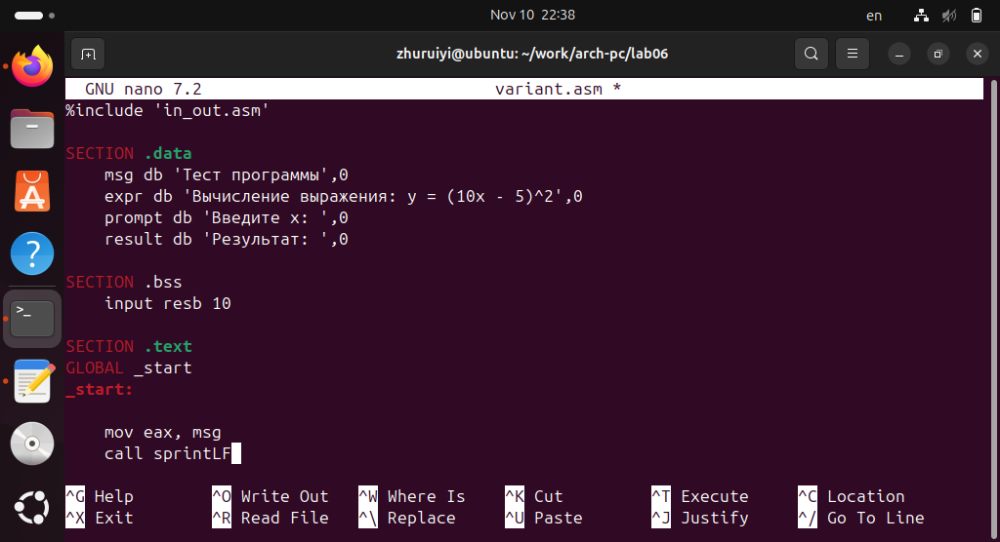


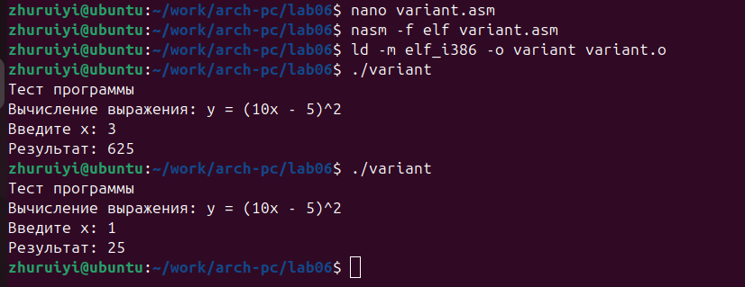


# Вывод:
## В ходе изучения лабораторной работы №6 мы освоили базовый синтаксис ассемблера NASM, использование арифметических инструкций, применение библиотек ввода-вывода, поняли кодировку символов и числовое представление, принципы работы регистров, вычисление варианта по номеру студенческого билета (номер билета mod 20) + 1, а также вычисление функций.
