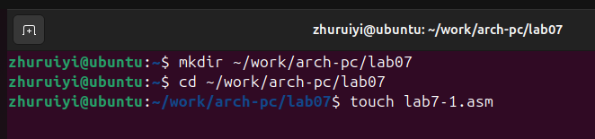
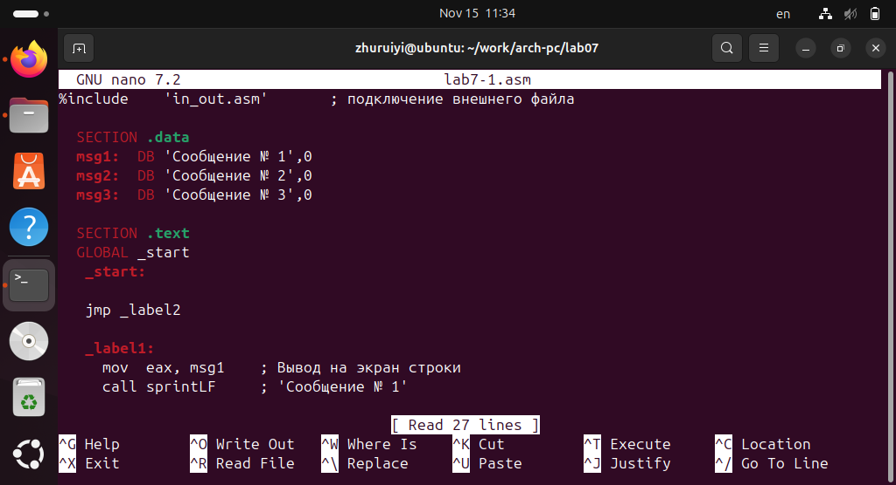
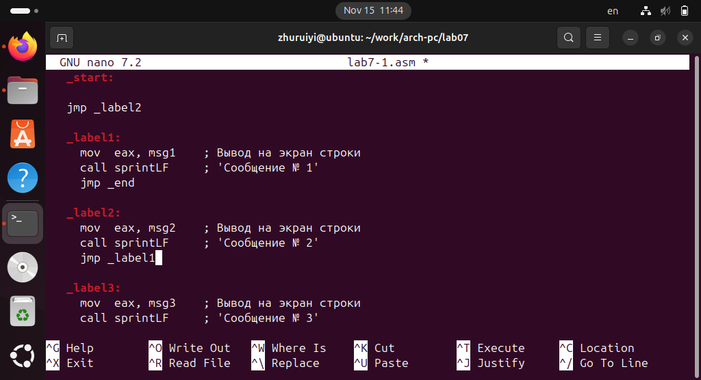
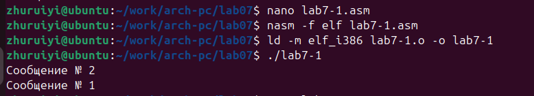
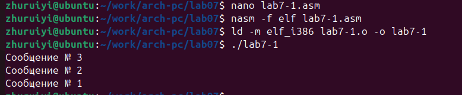
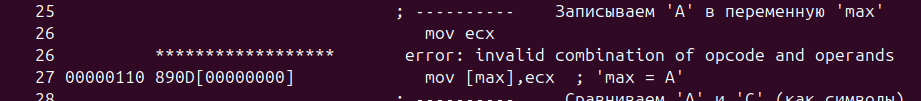
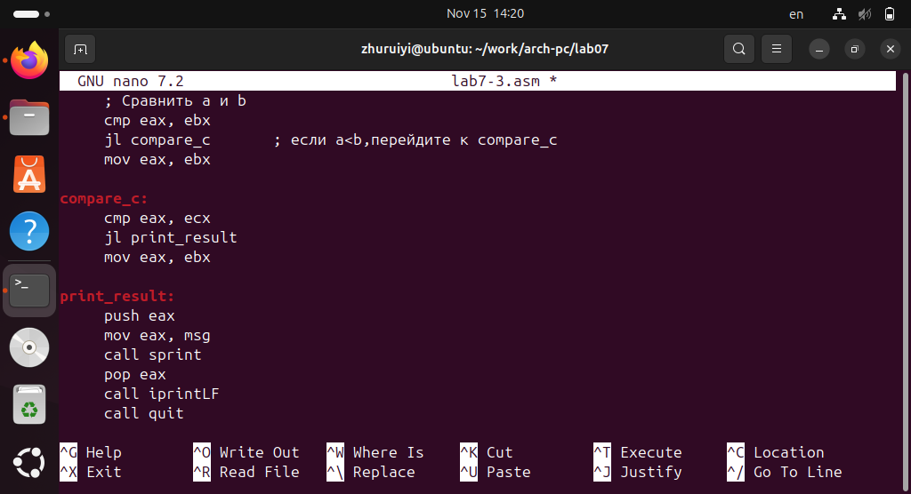
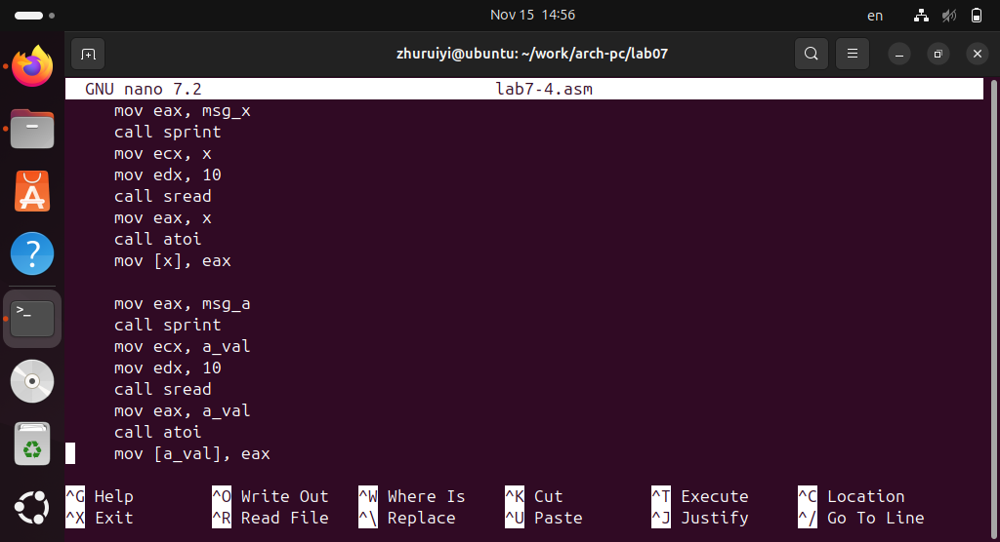

---
header-includes: |
  \usepackage{float}
  \let\origfigure\figure
  \let\endorigfigure\endfigure
  \renewenvironment{figure}[1][]{
    \origfigure[H]
  }{
    \endorigfigure
  }
---


---
title: "Лабораторная работа № 7"
author: "ЧжуЖуйи"
date: "16 ноября 2025 г."
---


# Цель работы
  Изучение команд условного и безусловного переходов. Приобретение навыков написания программ с использованием переходов. Знакомство с назначением и структурой файла листинга.

# Порядок выполнения лабораторной работы

## Реализация переходов в NASM

1. Создайте каталог для программам лабораторной работы № 7, перейдите в него и создайте файл lab7-1.asm:
```bash
mkdir ~/work/arch-pc/lab07
cd ~/work/arch-pc/lab07
touch lab7-1.asm
```




2. Инструкция jmp в NASM используется для реализации безусловных переходов. Рассмотрим пример программы с использованием инструкции jmp. Введите в файл lab7-1.asm текст программы из листинга 7.1.

*Листинг 7.1. Программа с использованием инструкции jmp*

```bash
%include   'in_out.asm'      ; подключение внешнего файла

  SECTION .data
  msg1:  DB 'Сообщение № 1',0
  msg2:  DB 'Сообщение № 2',0
  msg3:  DB 'Сообщение № 3',0

  SECTION .text
  GLOBAL _start
   _start:

   jmp _label2

   _label1:
     mov  eax, msg1   ; Вывод на экран строки
     call sprintLF    ; 'Сообщение № 1'

   _label2:
     mov  eax, msg2   ; Вывод на экран строки
     call sprintLF    ; 'Сообщение № 2'

   _label3:
     mov  eax, msg3   ; Вывод на экран строки
     call sprintLF    ; 'Сообщение № 3'

   _end:
     call quit        ; вызов подпрограммы завершения
```




  Инструкция jmp позволяет осуществлять переходы не только вперед но и назад. Изменим программу таким образом, чтобы она выводила сначала ‘Сообщение № 2’, потом ‘Сообщение № 1’ и завершала работу. Для этого в текст программы после вывода сообщения № 2 добавим инструкцию jmp с меткой _label1 (т.е. переход к инструкциям вывода сообщения № 1) и после вывода сообщения № 1 добавим инструкцию jmp с меткой _end (т.е. переход к инструкции call quit). Измените текст программы в соответствии с листингом 7.2.

*Листинг 7.2. Программа с использованием инструкции jmp*

```bash
%include 'in_out.asm' ; подключение внешнего файла
SECTION .data
msg1: DB 'Сообщение № 1',0
msg2: DB 'Сообщение № 2',0
msg3: DB 'Сообщение № 3',0
SECTION .text
GLOBAL _start
_start:
jmp _label2
_label1:
mov eax, msg1 ; Вывод на экран строки
call sprintLF ; 'Сообщение № 1'
jmp _end
_label2:
mov eax, msg2 ; Вывод на экран строки
call sprintLF ; 'Сообщение № 2'
jmp _label1
_label3:
mov eax, msg3 ; Вывод на экран строки
call sprintLF ; 'Сообщение № 3'
_end:
call quit ; вызов подпрограммы завершения
```






  Измените текст программы добавив или изменив инструкции jmp, чтобы вывод программы был следующим:
```bash
./lab7-1
Сообщение № 3
Сообщение № 2
Сообщение № 1
```





3. Использование инструкции jmp приводит к переходу в любом случае. Однако, часто при написании программ необходимо использовать условные переходы, т.е. переход должен происходить если выполнено какое-либо условие. В качестве примера рассмотрим программу, которая определяет и выводит на экран наибольшую из 3 целочисленных переменных: A,B и C. Значения для A и C задаются в программе, значение B вводиться с клавиатуры.

  Создайте файл lab7-2.asm в каталоге ~/work/arch-pc/lab07. Внимательно изучите текст программы из листинга 7.3 и введите в lab7-2.asm.

*Листинг 7.3. Программа, которая определяет и выводит на экран наибольшую из 3 целочисленных переменных: A,B и C.*

```bash
%include 'in_out.asm'
section        .data
   msg1 db 'Введите B: ',0h
   msg2 db "Наибольшее число: ",0h
   A dd '20'
   C dd '50'
section .bss
   max resb 10
   B resb 10
section        .text
   global _start
_start:
; ----------   Вывод сообщения 'Введите B: '
   mov eax,msg1
   call sprint
; ----------   Ввод 'B'
   mov ecx,B
   mov  edx,10
   call sread
; ----------   Преобразование 'B' из символа в число
   mov eax,B
   call atoi      ; Вызов подпрограммы перевода символа в число
   mov [B],eax    ; запись преобразованного числа в 'B'
; ----------    Записываем 'A' в переменную 'max'
   mov ecx,[A]    ; 'ecx = A'
   mov [max],ecx  ; 'max = A'
; ----------     Сравниваем 'A' и 'С' (как символы)
   cmp ecx,[C]    ; Сравниваем 'A' и 'С'
   jg check_B     ; если 'A>C', то переход на метку 'check_B',
   mov ecx,[C]    ; иначе 'ecx = C'
   mov [max],ecx  ; 'max = C'
; ----------  Преобразование 'max(A,C)' из символа в число
check_B:
   mov eax,max
   call atoi      ; Вызов подпрограммы перевода символа в число
   mov [max],eax  ; запись преобразованного числа в `max`
; ----------    Сравниваем 'max(A,C)' и 'B' (как числа)
   mov ecx,[max]
   cmp ecx,[B]    ; Сравниваем 'max(A,C)' и 'B'
   jg fin         ; если 'max(A,C)>B', то переход на 'fin',
   mov ecx,[B]    ; иначе 'ecx = B'
   mov [max],ecx
; ----------    Вывод результата
fin:
   mov eax, msg2
   call sprint   ; Вывод сообщения 'Наибольшее число: '
   mov eax,[max]
   call iprintLF ; Вывод 'max(A,B,C)'
   call quit     ; Выход
```


## Изучение структуры файлы листинга

4. Обычно nasm создаёт в результате ассемблирования только объектный файл. Получить файл листинга можно, указав ключ -l и задав имя файла листинга в командной строке. Создайте файл листинга для программы из файла lab7-2.asm
```bash
nasm -f elf -l lab7-2.lst lab7-2.asm
```

  Откройте файл листинга lab7-2.lst с помощью любого текстового редактора, например mcedit:
```bash
mcedit lab7-2.lst
```


  Внимательно ознакомиться с его форматом и содержимым. Подробно объяснить содержимое трёх строк файла листинга по выбору

1) Строка 4: 00000000 53 ; адрес : 00000000 - адрес смещения кода в памяти  ; машинный код: 53 - соответствующая шестнадцатеричная машинная инструкция ; исходный код : push ebx-соответствующие инструкции по собрке.
2) Строка 5: 00000001 89C3 машинный код 89C3 соответствует mov ebx,eax ;  89 - это команда mov,C3 означает, что целевым регистром является EBX , а исходным - EAX.
3) Строка 8: 00000003 803800 машинный код 803800 соответствует байту cmp [eax],0.


  Откройте файл с программой lab7-2.asm и в любой инструкции с двумя операндами удалить один операнд. Выполните трансляцию с получением файла листинга:
```bash
nasm -f elf -l lab7-2.lst lab7-2.asm
```





 Содержимое, добавленное в список, включает：

1) Отметка линии ошибки (^ указывает на неправильное местоположение)

2) Сообщение об ошибке (отображается в виде комментария)

3) Расположение машинного кода может отображаться как ********* (указывает на то, что действительный машинный код не может быть сгенерирован).

4) Возможное многострочное описание ошибки


# Задание для самостоятельной работы

1. Напишите программу нахождения наименьшей из 3 целочисленных переменных 𝑎,𝑏 и . Значения переменных выбрать из табл. 7.5 в соответствии с вариантом, полученным при выполнении лабораторной работы № 7. Создайте исполняемый файл и проверьте его работу.





2. Напишите программу, которая для введенных с клавиатуры значений 𝑥 и 𝑎 вычисляет значение заданной функции 𝑓(𝑥) и выводит результат вычислений. Вид функции 𝑓(𝑥) выбрать из таблицы 7.6 вариантов заданий в соответствии с вариантом, полученным при выполнении лабораторной работы № 7. Создайте исполняемый файл и проверьте его работу для значений 𝑥 и 𝑎 из 7.6.





# Вывод:
  Пройдя лабораторную работу №7, мы освоили методы управления потоком выполнения программ на языке ассемблера, поняли различия и области применения условных и безусловных переходов, научились использовать листинговые файлы для отладки и анализа, а также приобрели навыки написания ассемблерных программ для выполнения конкретных задач.

